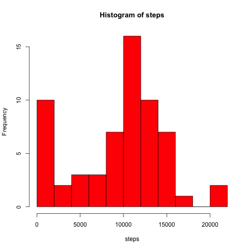
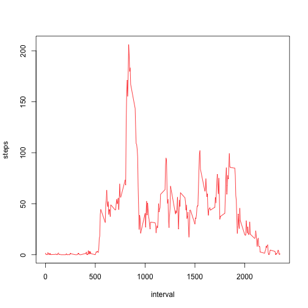
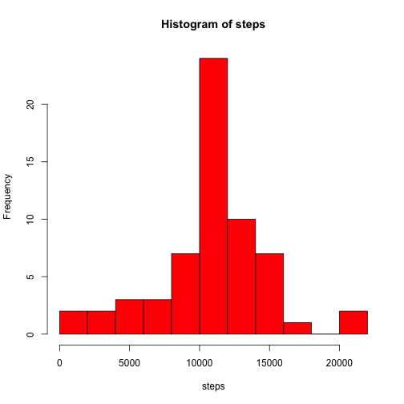
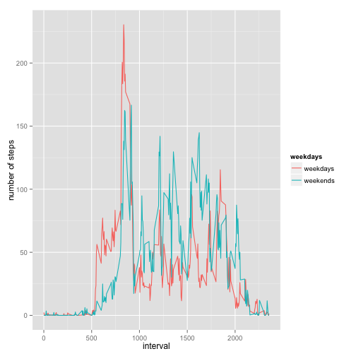

Course 5 (reproducible research) -- Peer Assignment 1
========================================================
## 1. Loading the data: 
    I will first download the data, unzip the file, and read into R using read.csv(). 
    The data includes three columns: steps, date, and interval, and 15840 rows in total. 
    Format the date properly for later use.  Note that the timezone is set to avoid confussion. 
    

```r
    library(plyr)
    library(ggplot2)
    library(lattice)
    setwd = '~/Downloads/Course5/RepData_PeerAssessment1'
    url = "https://d396qusza40orc.cloudfront.net/repdata%2Fdata%2Factivity.zip"
    download.file(url,destfile='activity.zip',method='curl')
    data<-read.csv(unzip('activity.zip'))
    Sys.setlocale("LC_TIME", "en_US.UTF-8")
```

```
## [1] "en_US.UTF-8"
```

```r
    data$date<- as.Date(data$date)
    summary(data)
```

```
##      steps            date               interval   
##  Min.   :  0.0   Min.   :2012-10-01   Min.   :   0  
##  1st Qu.:  0.0   1st Qu.:2012-10-16   1st Qu.: 589  
##  Median :  0.0   Median :2012-10-31   Median :1178  
##  Mean   : 37.4   Mean   :2012-10-31   Mean   :1178  
##  3rd Qu.: 12.0   3rd Qu.:2012-11-15   3rd Qu.:1766  
##  Max.   :806.0   Max.   :2012-11-30   Max.   :2355  
##  NA's   :2304
```

## 2. What is mean total number of steps taken per day?
    - count the steps per day by ddply in plyr package, and save the result as StepsPerDay. 
    Here, I just ignored the NA by setting na.rm=TRUE. 


```r
        StepsPerDay <- ddply(data,.(date),summarize,steps=sum(steps,na.rm=TRUE))
```

    - the mean and median of the number of steps per day are 9354.2295 and 10395 respectively.
    - show the histogram of the StepsPerDay. 
    Note that the frequency is high at the very first bin because of the entries with NA.
    

```r
    with(StepsPerDay, {
         hist(steps,col='red',breaks=10)
         meanStep = mean(steps,na.rm=TRUE)
         medianStep=median(steps, na.rm=TRUE)
    })
```

 


## 3. What is the average daily activity pattern?
    - similar to Step 2, count the steps of each interval using ddply and save the result to StepsPerInterval.

```r
    StepsPerInterval <- ddply(data,.(interval),summarize,steps=mean(steps,na.rm=TRUE))
```
    - The maximum steps and its corresponding interval are 206.1698 and 835 respectively.

    - show the time series of steps per 5-mins interval.

```r
    StepsPerInterval <- ddply(data,.(interval),summarize,steps=mean(steps,na.rm=TRUE))
    with(StepsPerInterval, {
        plot(interval,steps,type='l',col='red')
        maxSteps <- max(steps,na.rm=TRUE)
        maxInterval<-interval[which.max(steps)]    
    })
```

 

## 4. Inputing missing values:
    - Count the missing value in the table.

```r
    sum(is.na(data))
```

```
## [1] 2304
```
    - Replace the NA using the mean steps within each interval calculated in Step 3. 
    In details, I first identified the interval of each NAs (intervalNA), and their "index" 
    in the original dataframe. Then, I used sapply to find out the average steps of each 
    entry of intervalNA from the dataframe, StepsPerInterval. Finally, the NA is replaced 
    by the average steps per interval accordingly, and the missing value filled-in data 
    is stored in the new dataframe, dataNaFilledByIntMean.
    

```r
    dataNaFilledByIntMean <- data
    index<-which(is.na(data$steps))
    intervalNA<-data$interval[index]
    dataNaFilledByIntMean$steps[index] <- sapply(intervalNA,
        function(x) StepsPerInterval$steps[StepsPerInterval$interval == x])
```

    - Repeat step 2 to make a histogram of the total number of steps taken each day, 
    and report the mean and median total number of steps taken per day. 

```r
    StepsPerDayNaFilled <- ddply(dataNaFilledByIntMean,.(date),summarize,steps=sum(steps))
    with(StepsPerDayNaFilled, {
         hist(steps,breaks=10,col='red')
         meanStepsPerDayNaFilled<-mean(steps,na.rm=TRUE)
         medianStepsPerDayNaFilled<-median(steps,na.rm=TRUE)
         print(c(meanStepsPerDayNaFilled,medianStepsPerDayNaFilled))
    })
```

 

```
## [1] 10766 10766
```

    - The median and mean value are 1.0766 &times; 10<sup>4</sup> and 1.0766 &times; 10<sup>4</sup> respectively. 
    They are larger than the values in step 2, since the filled in values are always 
    non-negative. However, both of the value equal to the filled-in average steps 
    per day, so that they are not as informatic. 

## 5. Are there differences in activity patterns between weekdays and weekends?
    - Add a column to the filled in data for the label of the weekday or weekend. 

```r
    weekdays <- weekdays(dataNaFilledByIntMean$date)
    weekdays[weekdays == 'Sunday' | weekdays == 'Saturday'] = 'weekends'
    weekdays[weekdays != 'weekends'] = 'weekdays'
    dataNaFilledByIntMean$weekdays <- weekdays
```

    - calculate the average steps of each interval for the two levels of "weekdays" respectively.
    

```r
    StepsPerIntervalNaFilled <- ddply(dataNaFilledByIntMean,.(weekdays,interval),summarize,steps=mean(steps,na.rm=TRUE))
```

    - plot the histogram of the steps on weekday and weekend. I first used ggplot, 
    and found it doesn't quite match the reference plot. Therefore, I do it again with 
    lattice. Both of the plots are shown. 
    - The answer is YES. The activity pattern of weekday and weekend are different. 
    The activity of weekday is high in the morning before going to work. 
    On the other hand, the activity increases in the afternoon of weekends. 
    
    

```r
    ggplot(data=StepsPerIntervalNaFilled, aes(x=interval, y=steps,color=weekdays))+geom_line() + ylab('number of steps')
```

 

```r
    xyplot(steps ~ interval | weekdays, data=StepsPerIntervalNaFilled, layout=c(1,2),type='l',ylab='number of steps')
```

 

